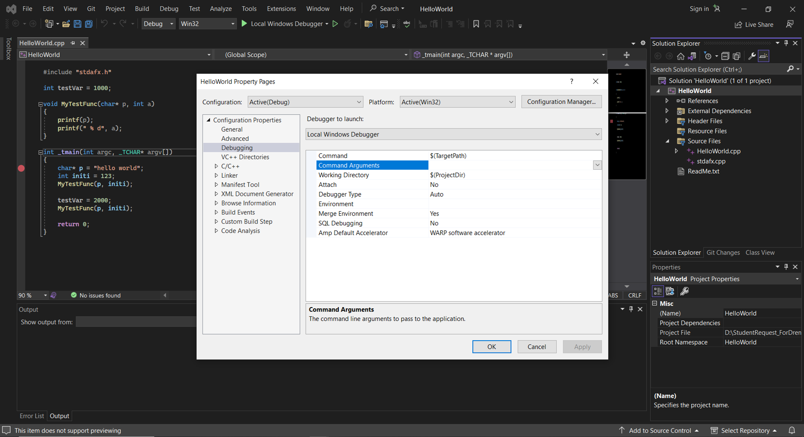
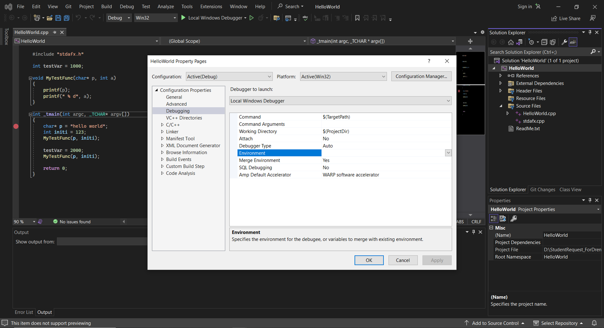
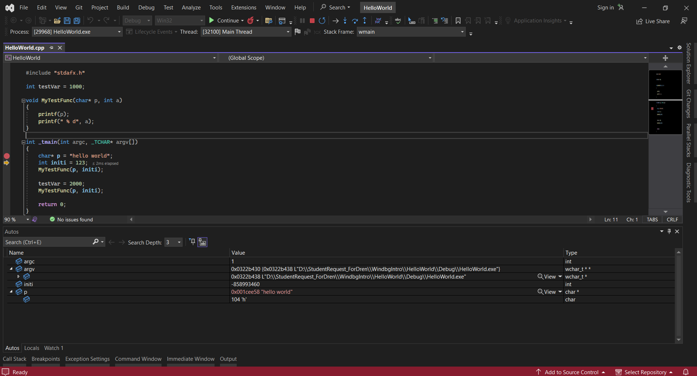
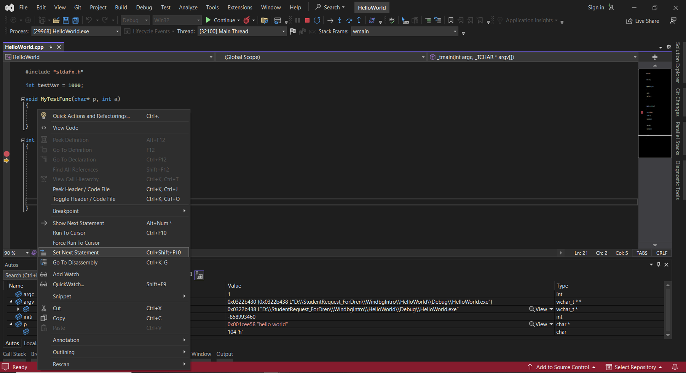
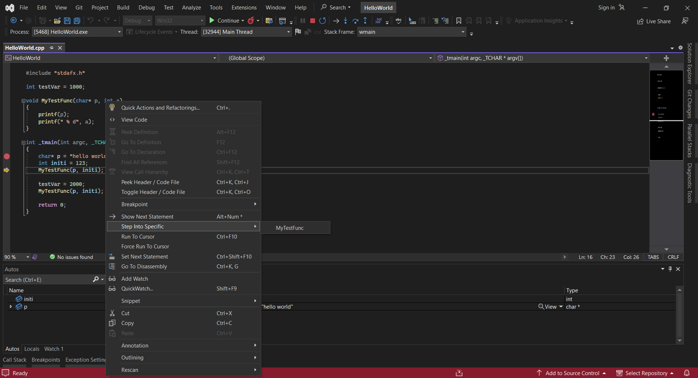
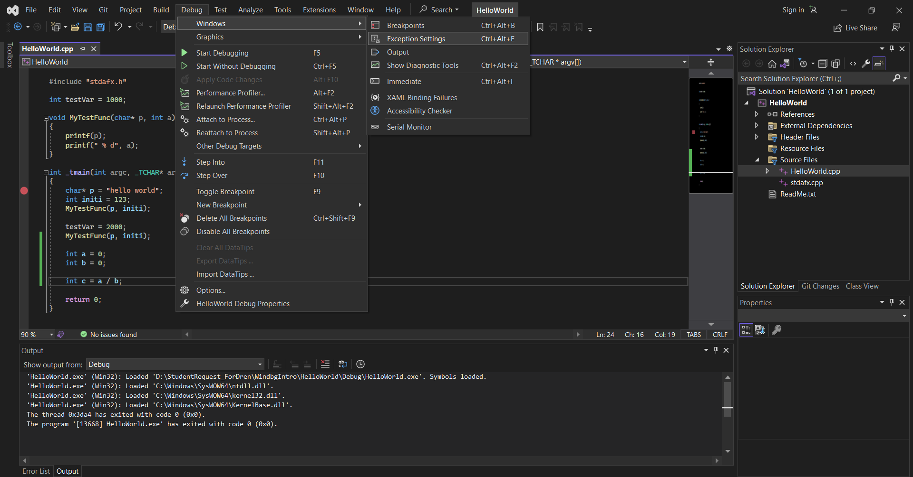
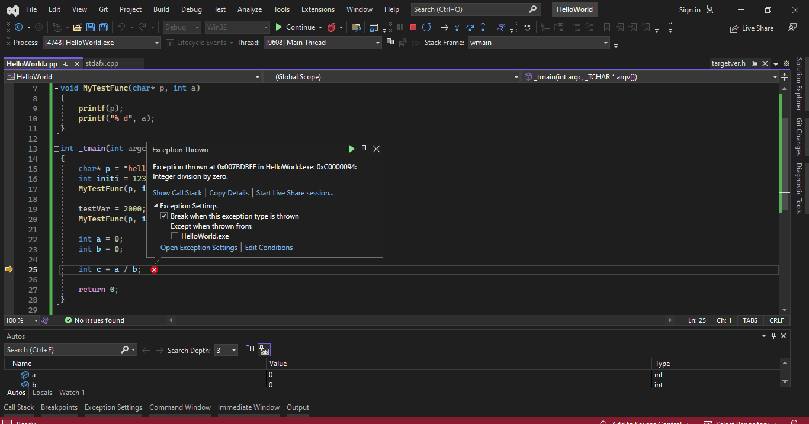

# Tips and Tricks C++ debugging Visual Studio
 
## Table of Content

* [**Configuring launch options from project properties**](#configuring-launch-options-from-project-properties-[command-line-arguments-and-setting-environment-variables]) <!-- style="font-size:20px" -->
* [**Seeing function return values**](#seeing-function-return-values) <!-- style="font-size:20px" -->
* [**Set next statement**](#set-next-statement) <!-- style="font-size:20px" -->
* [**Step into specific**](#step-into-specific) <!-- style="font-size:20px" -->
* [**Run to cursor**](#run-to-cursor) <!-- style="font-size:20px" -->
* [**Edit and Continue**](#edit-and-continue) <!-- style="font-size:20px" -->
* [**Exception Settings**](#exception-settings) <!-- style="font-size:20px" -->
* [**Conditional, Hit Count, and Filter Breakpoints**](#conditional,-hit-count,-and-filter-breakpoints) <!-- style="font-size:20px" -->
* [**Pinning DataTips**](#pinning-datatips) <!-- style="font-size:20px" -->
* [**Parallel Stacks window**](#parallel-stacks-window) <!-- style="font-size:20px" -->
* [**Show External Code**](#show-external-code) <!-- style="font-size:20px" -->
* [**Parallel Watch window**](#parallel-watch-window) <!-- style="font-size:20px" -->
* [**Freeze and Thaw threads**](#freeze-and-thaw-threads) <!-- style="font-size:20px" -->
* [**Flag Threads and Run Flagged Threads to Cursor**](#flag-threads-and-run-flagged-threads-to-cursor) <!-- style="font-size:20px" --> 
* [**Show Threads in source**](#show-threads-in-source) <!-- style="font-size:20px" -->
* [**Debug Location toolbar**](#debug-location-toolbar) <!-- style="font-size:20px" -->
* [**Debugging Heap Corruption with Page Heap**](#debugging-heap-corruption-with-page-heap) <!-- style="font-size:20px" -->
* [**PerfTips**](#perftips) <!-- style="font-size:20px" -->
* [**Integrated CPU profiling**](#integrated-cpu-profiling) <!-- style="font-size:20px" -->
* [**Integrated Memory Profiling**](#integrated-memory-profiling) <!-- style="font-size:20px" -->
* [**Natvis**](#natvis) <!-- style="font-size:20px" -->
* [**Showing what source code causes an Access Violation**](#showing-what-source-code-causes-an-access-violation) <!-- style="font-size:20px" -->

### **Configuring launch options from project properties [command line arguments and setting environment variables]**

Configuring launch options such as command line arguments and setting environment variables is typically done through your IDE's project settings. This can be useful for testing and debugging your code under different conditions.

* [**Setting Command Line Arguments**](#setting-command-line-arguments)
* [**Setting Environment Variables**](#setting-environment-variables)

#### **Setting Command Line Arguments**

1. In Visual Studio, open the "**Solution Explorer**" panel.
2. Right-click on your project, and select "**Properties**".
3. In the "**Property Pages**" dialog box that opens, expand "**Configuration Properties**" and select "**Debugging**".
4. In the "**Command Arguments**" field, enter your command line arguments.
5. Click "**Apply**", then "**OK**".

#### **Setting Environment Variables**

1. Follow the same steps as above to open the "**Debugging**" properties for your project.
2. In the "**Environment**" field, enter your environment variables in the form "**VARNAME=VALUE**". If you want to set multiple environment variables, separate them with newlines.
3. Click "**Apply**", then "**OK**".

Environment variables set in this way will be added to the environment for the process when your program runs.

### **Seeing function return values**

**1. Start Debugging**: You first need to start a debugging session. You can do this by clicking on "Debug" in the menu and then "Start Debugging", or by pressing F5.

**2. Set Breakpoints and Run to Them**: Set breakpoints at relevant points in your code by clicking in the margin to the left of the code or pressing F9. Run your code to the breakpoint by pressing F5.

**3. Step Over the Function**: When you hit a line of code with a function whose return value you want to inspect, use the "Step Over" command. You can do this by clicking "Debug" in the menu, then "Step Over", or by pressing F10. This will execute the function.

**4. Check the Autos Window**: After stepping over the function, look at the "Autos" window. This window automatically shows variables relevant to the current line of code and the previous statement. The return value of the last function called is displayed as a pseudo-variable, usually named something like $ReturnValue.

Remember, this will only show the return value of the most recently-called function. If you call another function, or the same function again, the displayed return value will be overwritten.

### **Set next statement**

The "Set Next Statement" feature in a debugger allows you to change the execution flow of your program. It essentially changes the location of the next instruction that the debugger will execute. This can be particularly useful when you want to skip certain lines of code, rerun certain parts of your code, or jump over exception throwing code.

1. **Start Debugging**: Begin a debugging session by clicking "Debug" on the menu and then "Start Debugging", or by pressing F5.
2. **Pause Execution**: Pause execution at a breakpoint or by clicking "Debug" on the menu and then "Break All", or by pressing Ctrl + Alt + Break.
3. **Set Next Statement**: In the code editor, right-click the line where you want to move the execution pointer (the yellow arrow), and click "Set Next Statement", or simply drag and drop the yellow arrow to the desired line.
4. **Continue Execution**: Press F5 or click "Continue" from the "Debug" menu to resume execution from the new location.

Remember that "Set Next Statement" alters the normal execution flow of your program, which can have unexpected side effects. For example, if you move the execution pointer over a line that initializes a variable, that variable will remain uninitialized. Similarly, if you move the execution pointer back to re-run code that modifies a variable, that variable will be modified again.

### **Step into specific**

The "Step Into Specific" command in a debugger is used when you want to step into a specific function when there are multiple function calls on a single line of code. This command gives you control over which function call you want to step into, which can be useful when debugging complex lines of code.

1. **Start Debugging**: Begin a debugging session by clicking "Debug" on the menu and then "Start Debugging", or by pressing F5.
2. **Pause Execution**: Pause execution at a breakpoint or by clicking "Debug" on the menu and then "Break All", or by pressing Ctrl + Alt + Break.
3. **Step Into Specific**: If you are paused on a line with multiple function calls and you want to step into a specific function, right-click on that line of code in the code editor, hover over "Step Into Specific", and then select the function that you want to step into from the list that appears.
4. **Continue Execution**: After stepping into the specific function, you can step through its code line by line using the "Step Over" command (F10), or step into further function calls using the "Step Into" command (F11). You can resume normal execution by pressing F5 or clicking "Continue" from the "Debug" menu.

The "Step Into Specific" command can help you navigate directly to the code you are interested in, saving you from having to step through other functions that you're not currently interested in debugging.

### **Run to cursor**

"Run to Cursor" is a debugging command available in Visual Studio. It allows you to continue the execution of your program until it reaches the line of code where your cursor is currently placed.

This can be very useful if you want to quickly jump to a specific line of code without manually stepping through each line or setting a temporary breakpoint.

1. **Start Debugging**: Begin a debugging session by clicking "Debug" on the menu and then "Start Debugging", or by pressing F5.
2. **Pause Execution**: Pause execution at a breakpoint or by clicking "Debug" on the menu and then "Break All", or by pressing Ctrl + Alt + Break.
3. **Run to Cursor**: Place your cursor on the line where you want the execution to run to. Then right-click and select "Run to Cursor", or simply press Ctrl + F10. The debugger will continue execution until it reaches that line, or until it hits another breakpoint on the way.

**NOTE:**

“Run to Cursor” behaves like a temporary breakpoint at the specific line of code. If there is code (like exception throwing code) that prevents reaching that line, the debugger will stop at that point. Similarly, if there's a breakpoint set before the line with the cursor, the debugger will stop at that breakpoint.

### **Edit and Continue** 

"Edit and Continue" is a time-saving feature in Visual Studio that allows you to make changes to your code during a debugging session, and then continue execution with the new code without needing to stop and start your debugging session.

This can be very helpful for fixing bugs or fine-tuning your code, as you don't have to go through the whole cycle of stopping the debugger, editing the code, and starting the debugger again.

1. Start a debugging session.
2. Pause execution, either by hitting a breakpoint or by manually pausing the debugger.
3. Edit the code: You can make various changes, such as modifying existing code, adding new code, or even changing the values of variables.
4. Once you're done with your changes, simply press F5 or click the "Continue" button to continue execution. Visual Studio will automatically apply your changes.

### **Exception Settings**

In Visual Studio, the Exception Settings window allows you to specify which exceptions (or classes of exceptions) will cause the debugger to break, and at what point you would like it to do so. This can be extremely useful when debugging, as it allows you to catch and handle exceptions at the time they are thrown, rather than later when they might have caused other issues in your application.

**1. Open the Exception Settings window**: You can open this window by clicking "Debug" on the menu, then "Windows", then "Exception Settings". Alternatively, you can use the shortcut Ctrl + Alt + E.

**2. Configure exceptions**: The Exception Settings window provides a list of exception types. You can specify whether you want the debugger to break when an exception is thrown, or when an exception is unhandled.

* **Break when Thrown**: If you want the debugger to break execution as soon as a specific type of exception is thrown, before any catch block is invoked, you can check the box next to the exception type in the list.

* **Break when Unhandled**: By default, the debugger will break for unhandled exceptions. This means when an exception is thrown and it's not caught and handled in your code, the debugger will stop and let you inspect it.

You can configure these settings for all exceptions, or you can expand the nodes in the tree and configure them for specific exceptions.

In this example it throws integer divison by zero , select the exception and start debugging session.

### **Conditional, Hit Count, and Filter Breakpoints**

Visual Studio provides powerful features for controlling breakpoints, which are essential in debugging. These features include conditional breakpoints, hit count breakpoints, and filter breakpoints.

**1. Conditional Breakpoints**: A conditional breakpoint is only triggered when a specified condition is met. For example, you can set a breakpoint to be hit only when a certain variable equals a particular value. To set a conditional breakpoint:

* Right-click on an existing breakpoint (the red dot in the left margin).
* Select "Conditions".
* Choose either "Conditional Expression" or "Hit Count" (explained below) and enter the appropriate condition.
* Click "Close".

Hit Count Breakpoints: A hit count breakpoint is a type of conditional breakpoint that only triggers when it has been hit a specified number of times. This can be useful in situations such as when you're working with loops or recurring method calls. To set a hit count breakpoint:

Right-click on an existing breakpoint.
Select "Conditions".
Choose "Hit Count" and then specify the count condition (for example, break when the hit count is "equal to" a certain number, "a multiple of" a certain number, etc.).
Click "Close".

### **Pinning DataTips**
### **Parallel Stacks window**
### **Show External Code**
### **Parallel Watch window**
### **Freeze and Thaw threads**
### **Flag Threads and Run Flagged Threads to Cursor**
### **Show Threads in source**
### **Debug Location toolbar**
### **Debugging Heap Corruption with Page Heap**
### **PerfTips**
### **Integrated CPU profiling**
### **Integrated Memory Profiling**
### **Natvis**
### **Showing what source code causes an Access Violation**