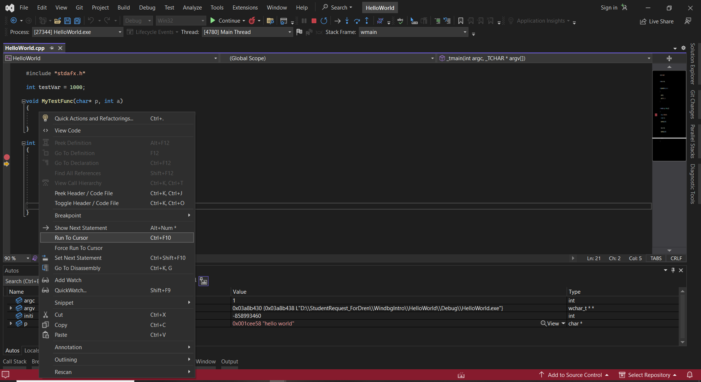

# Tips and Tricks C++ debugging Visual Studio
 
## Table of Content

* [**Configuring launch options from project properties**](#configuring-launch-options-from-project-properties-[command-line-arguments-and-setting-environment-variables]) <!-- style="font-size:20px" -->
* [**Seeing function return values**](#seeing-function-return-values) <!-- style="font-size:20px" -->
* [**Set next statement**](#set-next-statement) <!-- style="font-size:20px" -->
* [**Step into specific**](#step-into-specific) <!-- style="font-size:20px" -->
* [**Run to cursor**](#run-to-cursor) <!-- style="font-size:20px" -->
* [**Edit and Continue**](#edit-and-continue) <!-- style="font-size:20px" -->
* [**Exception Settings**](#exception-settings) <!-- style="font-size:20px" -->
* [**Conditional, Hit Count, and Filter Breakpoints**](#conditional,-hit-count,-and-filter-breakpoints) <!-- style="font-size:20px" -->
* [**Pinning DataTips**](#pinning-datatips) <!-- style="font-size:20px" -->
* [**Parallel Stacks window**](#parallel-stacks-window) <!-- style="font-size:20px" -->
* [**Show External Code**](#show-external-code) <!-- style="font-size:20px" -->
* [**Parallel Watch window**](#parallel-watch-window) <!-- style="font-size:20px" -->
* [**Freeze and Thaw threads**](#freeze-and-thaw-threads) <!-- style="font-size:20px" -->
* [**Flag Threads and Run Flagged Threads to Cursor**](#flag-threads-and-run-flagged-threads-to-cursor) <!-- style="font-size:20px" --> 
* [**Show Threads in source**](#show-threads-in-source) <!-- style="font-size:20px" -->
* [**Debug Location toolbar**](#debug-location-toolbar) <!-- style="font-size:20px" -->
* [**Integrated CPU profiling**](#integrated-cpu-profiling) <!-- style="font-size:20px" -->
* [**Integrated Memory Profiling**](#integrated-memory-profiling) <!-- style="font-size:20px" -->

### **Configuring launch options from project properties [command line arguments and setting environment variables]**

Configuring launch options such as command line arguments and setting environment variables is typically done through your IDE's project settings. This can be useful for testing and debugging your code under different conditions.

* [**Setting Command Line Arguments**](#setting-command-line-arguments)
* [**Setting Environment Variables**](#setting-environment-variables)

#### **Setting Command Line Arguments**

1. In Visual Studio, open the "**Solution Explorer**" panel.
2. Right-click on your project, and select "**Properties**".
3. In the "**Property Pages**" dialog box that opens, expand "**Configuration Properties**" and select "**Debugging**".
4. In the "**Command Arguments**" field, enter your command line arguments.
5. Click "**Apply**", then "**OK**".

#### **Setting Environment Variables**

1. Follow the same steps as above to open the "**Debugging**" properties for your project.
2. In the "**Environment**" field, enter your environment variables in the form "**VARNAME=VALUE**". If you want to set multiple environment variables, separate them with newlines.
3. Click "**Apply**", then "**OK**".

Environment variables set in this way will be added to the environment for the process when your program runs.

### **Seeing function return values**

**1. Start Debugging**: You first need to start a debugging session. You can do this by clicking on "Debug" in the menu and then "Start Debugging", or by pressing F5.

**2. Set Breakpoints and Run to Them**: Set breakpoints at relevant points in your code by clicking in the margin to the left of the code or pressing F9. Run your code to the breakpoint by pressing F5.

**3. Step Over the Function**: When you hit a line of code with a function whose return value you want to inspect, use the "Step Over" command. You can do this by clicking "Debug" in the menu, then "Step Over", or by pressing F10. This will execute the function.

**4. Check the Autos Window**: After stepping over the function, look at the "Autos" window. This window automatically shows variables relevant to the current line of code and the previous statement. The return value of the last function called is displayed as a pseudo-variable, usually named something like $ReturnValue.

Remember, this will only show the return value of the most recently-called function. If you call another function, or the same function again, the displayed return value will be overwritten.

### **Set next statement**

The "Set Next Statement" feature in a debugger allows you to change the execution flow of your program. It essentially changes the location of the next instruction that the debugger will execute. This can be particularly useful when you want to skip certain lines of code, rerun certain parts of your code, or jump over exception throwing code.

1. **Start Debugging**: Begin a debugging session by clicking "Debug" on the menu and then "Start Debugging", or by pressing F5.
2. **Pause Execution**: Pause execution at a breakpoint or by clicking "Debug" on the menu and then "Break All", or by pressing Ctrl + Alt + Break.
3. **Set Next Statement**: In the code editor, right-click the line where you want to move the execution pointer (the yellow arrow), and click "Set Next Statement", or simply drag and drop the yellow arrow to the desired line.
4. **Continue Execution**: Press F5 or click "Continue" from the "Debug" menu to resume execution from the new location.

Remember that "Set Next Statement" alters the normal execution flow of your program, which can have unexpected side effects. For example, if you move the execution pointer over a line that initializes a variable, that variable will remain uninitialized. Similarly, if you move the execution pointer back to re-run code that modifies a variable, that variable will be modified again.

### **Step into specific**

The "Step Into Specific" command in a debugger is used when you want to step into a specific function when there are multiple function calls on a single line of code. This command gives you control over which function call you want to step into, which can be useful when debugging complex lines of code.

1. **Start Debugging**: Begin a debugging session by clicking "Debug" on the menu and then "Start Debugging", or by pressing F5.
2. **Pause Execution**: Pause execution at a breakpoint or by clicking "Debug" on the menu and then "Break All", or by pressing Ctrl + Alt + Break.
3. **Step Into Specific**: If you are paused on a line with multiple function calls and you want to step into a specific function, right-click on that line of code in the code editor, hover over "Step Into Specific", and then select the function that you want to step into from the list that appears.
4. **Continue Execution**: After stepping into the specific function, you can step through its code line by line using the "Step Over" command (F10), or step into further function calls using the "Step Into" command (F11). You can resume normal execution by pressing F5 or clicking "Continue" from the "Debug" menu.

The "Step Into Specific" command can help you navigate directly to the code you are interested in, saving you from having to step through other functions that you're not currently interested in debugging.

### **Run to cursor**

"Run to Cursor" is a debugging command available in Visual Studio. It allows you to continue the execution of your program until it reaches the line of code where your cursor is currently placed.

This can be very useful if you want to quickly jump to a specific line of code without manually stepping through each line or setting a temporary breakpoint.

1. **Start Debugging**: Begin a debugging session by clicking "Debug" on the menu and then "Start Debugging", or by pressing F5.
2. **Pause Execution**: Pause execution at a breakpoint or by clicking "Debug" on the menu and then "Break All", or by pressing Ctrl + Alt + Break.
3. **Run to Cursor**: Place your cursor on the line where you want the execution to run to. Then right-click and select "Run to Cursor", or simply press Ctrl + F10. The debugger will continue execution until it reaches that line, or until it hits another breakpoint on the way.

**NOTE:**

“Run to Cursor” behaves like a temporary breakpoint at the specific line of code. If there is code (like exception throwing code) that prevents reaching that line, the debugger will stop at that point. Similarly, if there's a breakpoint set before the line with the cursor, the debugger will stop at that breakpoint.

### **Edit and Continue** 

"Edit and Continue" is a time-saving feature in Visual Studio that allows you to make changes to your code during a debugging session, and then continue execution with the new code without needing to stop and start your debugging session.

This can be very helpful for fixing bugs or fine-tuning your code, as you don't have to go through the whole cycle of stopping the debugger, editing the code, and starting the debugger again.

1. Start a debugging session.
2. Pause execution, either by hitting a breakpoint or by manually pausing the debugger.
3. Edit the code: You can make various changes, such as modifying existing code, adding new code, or even changing the values of variables.
4. Once you're done with your changes, simply press F5 or click the "Continue" button to continue execution. Visual Studio will automatically apply your changes.

### **Exception Settings**

In Visual Studio, the Exception Settings window allows you to specify which exceptions (or classes of exceptions) will cause the debugger to break, and at what point you would like it to do so. This can be extremely useful when debugging, as it allows you to catch and handle exceptions at the time they are thrown, rather than later when they might have caused other issues in your application.

**1. Open the Exception Settings window**: You can open this window by clicking "Debug" on the menu, then "Windows", then "Exception Settings". Alternatively, you can use the shortcut Ctrl + Alt + E.

**2. Configure exceptions**: The Exception Settings window provides a list of exception types. You can specify whether you want the debugger to break when an exception is thrown, or when an exception is unhandled.

* **Break when Thrown**: If you want the debugger to break execution as soon as a specific type of exception is thrown, before any catch block is invoked, you can check the box next to the exception type in the list.

* **Break when Unhandled**: By default, the debugger will break for unhandled exceptions. This means when an exception is thrown and it's not caught and handled in your code, the debugger will stop and let you inspect it.

You can configure these settings for all exceptions, or you can expand the nodes in the tree and configure them for specific exceptions.

In this example it throws integer divison by zero , select the exception and start debugging session.

### **Conditional, Hit Count, and Filter Breakpoints**

Visual Studio provides powerful features for controlling breakpoints, which are essential in debugging. These features include conditional breakpoints, hit count breakpoints, and filter breakpoints.

* [**Conditional Breakpoints**](#conditional-breakpoints)
* [**Hit Count Breakpoints**](#hit-count-breakpoints)
* [**Filter Breakpoints**](#filter-breakpoints)

#### **Conditional Breakpoints** 

A conditional breakpoint is only triggered when a specified condition is met. For example, you can set a breakpoint to be hit only when a certain variable equals a particular value. 

To set a conditional breakpoint:

* Right-click on an existing breakpoint (the red dot in the left margin).
* Select "Conditions".
* Choose "Conditional Expression" and enter the appropriate condition.
* Click "Close".

#### **Hit Count Breakpoints** 

A hit count breakpoint is a type of conditional breakpoint that only triggers when it has been hit a specified number of times. This can be useful in situations such as when you're working with loops or recurring method calls.

To set a hit count breakpoint:

* Right-click on an existing breakpoint.
* Select "Conditions".
* Choose "Hit Count" and then specify the count condition (for example, break when the hit count is "equal to" a certain number, "a multiple of" a certain number, etc.).
* Click "Close".

#### **Filter Breakpoints**

Filter breakpoints allow you to narrow down even further by specifying that the breakpoint should only be hit for certain threads, processes, or machine names. This is especially useful when debugging multi-threaded or distributed applications. 

To set a filter breakpoint:

* Right-click on an existing breakpoint.
* Select "Filter".
* Specify the filter condition (for example, MachineName = "MyServer" or ThreadId = 3).
* Click "Close".

### **Pinning DataTips**

DataTips are a type of debugging tool provided by Visual Studio that show the value of variables when you hover over them in the code editor while debugging. They are essentially tooltips for your data.

**Pinning DataTips**: You can pin DataTips to your code window, so they remain visible as you move around in your code. This can be helpful if you want to keep track of how specific values change as your code executes.

To pin a DataTip, follow these steps:

**Start Debugging**: Start a debugging session by clicking "Debug" from the menu and then "Start Debugging", or pressing F5.
**Pause Execution**: Pause execution at a breakpoint or manually pause the program from the Debug menu.
**Hover over a Variable**: Hover over a variable to display a DataTip showing its current value.
**Pin the DataTip**: Click the pin icon on the left side of the DataTip to pin it to your code window.

Once a DataTip is pinned, it will stay visible even if you move your cursor away. You can move a pinned DataTip by dragging it, and you can unpin it by clicking the pin icon again.

Pinned DataTips will also appear in future debugging sessions at the same location, which can be very useful when you're repeatedly debugging the same code.

### **Parallel Stacks window**

The Parallel Stacks window in Visual Studio provides a graphical view of all call stacks for all your threads at the same time. It can be a very powerful tool when debugging multi-threaded applications, as it helps you understand the state of your application and how the execution of different threads interrelates.

The Parallel Stacks window provides two views: "Threads" and "Tasks" (for parallel tasks in .NET). In both views, each box represents a function call, and each column represents a thread or task. An arrow represents a function call, pointing from the caller to the callee.

**To use the Parallel Stacks window:**

* **Start Debugging**: Begin a debugging session by clicking "Debug" on the menu and then "Start Debugging", or pressing F5.
* **Pause Execution**: Pause execution at a breakpoint or manually pause the program from the Debug menu.
* **Open the Parallel Stacks Window**: Click "Debug" on the menu, then "Windows", then "Parallel Stacks". You can also use the keyboard shortcut Ctrl + Shift + D, S.

By default, the Parallel Stacks window shows the "Threads" view. If you're debugging a .NET application and want to see the "Tasks" view, click on the "Tasks" button at the top of the window.

**In the Parallel Stacks window, you can:**

* **View the call stack of each thread or task**: Each box in the diagram represents a function call. The box at the top of each column represents the current function for that thread or task.
* **Switch to a different thread or task**: Click on a box in the diagram to switch to that function call in that thread or task. The source code window will update to show the corresponding source code.
* **See where threads or tasks are executing the same function**: If multiple threads or tasks are executing the same function, they will be grouped together under a single box.

The Parallel Stacks window can help you understand complex threading and synchronization issues in your code, such as deadlocks or race conditions. It's a great tool for visualizing the state of your multi-threaded application.

### **Show External Code**

The "Show External Code" option in Visual Studio allows you to see frames from external, system, and third-party code in the Call Stack window when you're debugging. This feature can be useful when you're trying to understand the sequence of function calls that led to the current location, including calls made into libraries or system code.

To toggle the "Show External Code" feature:

* **Start Debugging**: Begin a debugging session by clicking "Debug" on the menu and then "Start Debugging", or pressing F5.
* **Pause Execution**: Pause execution at a breakpoint or manually pause the program from the Debug menu.
* **Open the Call Stack Window**: Click "Debug" on the menu, then "Windows", then "Call Stack". Alternatively, you can use the keyboard shortcut Ctrl + Alt + C.
* **Toggle "Show External Code"**: Right-click anywhere in the Call Stack window, and click on "Show External Code" in the context menu that appears.

When the "Show External Code" option is enabled, the Call Stack window will show all function calls, including those in external code. When it's disabled, the Call Stack window will only show calls in your own code, and it will collapse calls in external code into "[External Code]" frames.

### **Parallel Watch window**

The Parallel Watch window in Visual Studio is an advanced tool for observing the values of variables across multiple threads or tasks when you are debugging. It gives you the ability to compare the value of a variable or an expression for all threads or tasks at once, which can be extremely useful in multithreaded or parallel programming.

**To use the Parallel Watch window:**

* **Start Debugging**: Begin a debugging session by clicking "Debug" on the menu and then "Start Debugging", or pressing F5.
* **Pause Execution**: Pause execution at a breakpoint or manually pause the program from the Debug menu.
* **Open the Parallel Watch Window**: Click "Debug" on the menu, then "Windows", then "Parallel Watch". You will see multiple Parallel Watch windows (Parallel Watch 1, Parallel Watch 2, etc.), which allows you to watch different variables or expressions in each window.

In the Parallel Watch window, each row represents a different thread or task, and each column represents a different watch expression. The values of the watch expressions are displayed for each thread or task, allowing you to see how the values vary across different execution contexts.

By right-clicking in the window, you can add or modify watch expressions, refresh the values, or change the view between threads and tasks. You can also control which threads or tasks are shown by using the "Show Threads in Category" or "Show Tasks in Category" options.

### **Freeze and Thaw threads**

When debugging multi-threaded applications in Visual Studio, you might find it helpful to control the execution of individual threads independently. You can do this by freezing and thawing threads.

Freezing a thread suspends its execution, allowing other threads to run freely. This can be useful when you want to prevent a particular thread from making further progress for some time. For example, you might freeze a thread to prevent it from acquiring a lock or changing a shared variable.

Thawing a thread, on the other hand, resumes its execution if it was previously frozen.

Here's how you can freeze and thaw threads in Visual Studio:

* **Start Debugging**: Begin a debugging session by clicking "Debug" on the menu and then "Start Debugging", or pressing F5.
* **Pause Execution**: Pause execution at a breakpoint or manually pause the program from the Debug menu.
* **Open the Threads Window**: Click "Debug" on the menu, then "Windows", then "Parallel Watch".
* **Freeze or Thaw a Thread**: In the Parallel Watch window, right-click on the thread you want to freeze or thaw. Then, select "Freeze" to suspend the thread's execution, or "Thaw" to resume the thread's execution.

Please note that freezing a thread won't prevent it from holding locks. So, if other threads are waiting on a lock held by a frozen thread, they will be blocked until you thaw the frozen thread.

### **Flag Threads and Run Flagged Threads to Cursor**

**Flagging a Thread**

You might have several threads in your application, but often, you're only interested in one or a few threads. By flagging a thread, you mark it as important so that it stands out from other threads. Here's how you can flag a thread:

* Start debugging and pause execution.
* Click "Debug" on the menu, then "Windows", then "Parallel Watch".
* In the Parallel Watch window, right-click on the thread you want to flag and select "Flag" from the context menu.
* Flagged threads are indicated by a flag icon in the Threads window. You can also view all flagged threads by choosing "Flagged Threads" from the "Debug Location" toolbar.

* **Running Flagged Threads to Cursor** 

Once you have flagged a thread, you can run just that thread to the cursor. This allows you to advance execution for a specific thread while leaving others paused. Here's how you can run a flagged thread to the cursor:

* Place the cursor at the line of code where you want the execution to advance to.
* Right-click on the line of code and select "Run Flagged Threads to Cursor" from the context menu.

By flagging threads and running flagged threads to a cursor, you can focus on the threads that matter most to you and better manage the complexity of multithreaded debugging.

### **Show Threads in source**

"Show Threads in Source" is a very useful feature in Visual Studio that helps when debugging multithreaded applications. It shows you the locations of all your threads in your source code directly, giving you a clear picture of the execution state of each thread.

When this option is enabled, markers for each thread are displayed in the scrollbar and next to the code lines in the text editor. Each marker includes the thread ID and the thread name (if it has one). If you hover over a marker, a tooltip shows more information about the thread.

These markers can help you understand which parts of your code are being executed by which threads at any given point in time, helping you debug more effectively. It's especially useful for visualizing race conditions, deadlocks, and other complex multithreading issues.

### **Debug Location toolbar**

The Debug Location toolbar in Visual Studio is a handy tool that provides context about your current debugging session, like the current process, thread, and stack frame. It also allows you to quickly navigate through these.

Here's a brief overview of what you'll typically find on the Debug Location toolbar:

* **Process List**: If you're debugging more than one process (like in a multi-process application), this dropdown list allows you to switch between them.
* **Thread List**: This dropdown list lets you switch between the different threads in your application. Threads can be named or unnamed, and this list shows the thread ID, the location where it's currently broken (if applicable), and any flags.
* **Stack Frame List**: This dropdown list shows the call stack for the current thread. You can select a different stack frame to change the debugging context. This changes the highlighted code in the source window and updates the contents of the Locals, Autos, and Watch windows.
* **Step Into Context**: If the line of code at the current instruction pointer calls into other functions, you can select which function you want to step into from this dropdown list.
* **Flagged Threads and Flag/Unflag Thread**: These controls let you manage thread flags. You can quickly navigate to flagged threads, or flag/unflag the current thread.
* **Show Next Statement**: Clicking this will navigate the source window to the current instruction pointer (the next statement that will be executed).
* **Show Threads in Source**: When this is enabled, markers are shown in the source window for each location that is on a call stack of any thread.
* **Show External Code**: When this is enabled, the call stack includes entries for external code.

### **Integrated CPU profiling**

 Visual Studio provides integrated CPU profiling capabilities via the Performance Profiler, which allows you to investigate CPU usage in your applications. It helps you identify portions of code that consume more CPU resources and might be potential candidates for optimization.

Here's a brief guide on how to use the integrated CPU profiling:

* **Open the Performance Profiler**: You can open the Performance Profiler by going to "Debug" -> "Performance Profiler...", or by using the shortcut Alt + F2.
* **Choose CPU Usage Tool**: In the Performance Profiler, make sure the "CPU Usage" tool is selected. You can select other tools as well depending on your profiling needs.
* **Start Profiling**: Click "Start" to run your application and begin profiling. Use your application as normal, and try to perform the tasks that you suspect might be causing CPU performance issues.
* **Stop Profiling**: When you're done, stop the application, or click "Stop collection" in the Performance Profiler. Visual Studio will then process the profiling data and display the results.

In the CPU Usage tool's results, you'll see a timeline of CPU usage, and a list of functions sorted by their CPU usage. You can explore this data to identify areas of high CPU usage. Clicking on a function will show you its "Caller/Callee" view, where you can see which functions called this function, and which functions it called, along with their CPU usage.

### **Integrated Memory Profiling**

Visual Studio provides an integrated Memory Profiler, which is part of its Performance Profiler tools. The Memory Profiler tool allows you to investigate memory usage in your applications, helping you to identify any potential memory leaks or areas of inefficient memory use.

Here's how to use the integrated Memory Profiling:

* **Open the Performance Profiler**: Go to "Debug" -> "Performance Profiler..." or use the shortcut Alt + F2.
* **Choose .NET Memory Tool**: In the Performance Profiler, ensure the "Memory Usage" tool is selected.
* **Start Profiling**: Click "Start" to run your application and begin profiling. Use your application as you normally would, particularly focusing on actions you suspect may cause high memory usage or memory leaks.
* **Take Snapshots**: While your application is running, you can take memory snapshots at any point by clicking on "Take snapshot" in the Performance Profiler. These snapshots capture the state of the managed heap, letting you analyze memory usage in detail.
* **Stop Profiling**: Once you have finished, stop your application or click "Stop collection" in the Performance Profiler. Visual Studio will then process the profiling data and display the results.

The Memory Profiler will provide a graphical representation of memory usage over time. Snapshots taken during the profiling session can be examined in detail to review the objects present on the heap and the memory they are consuming. By comparing two snapshots, you can see what has changed over time, helping you to pinpoint potential memory leaks.

